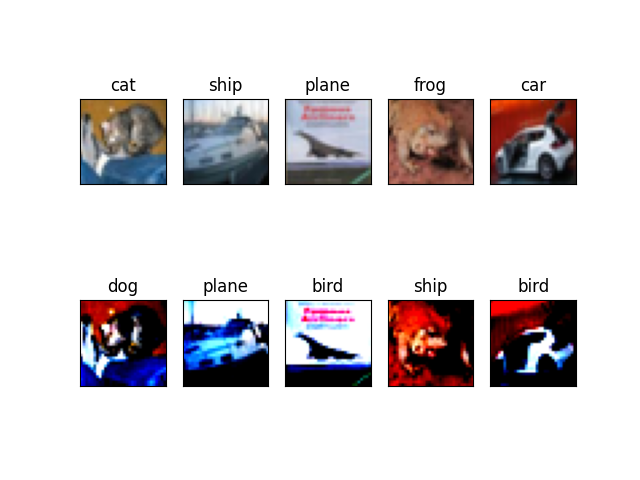
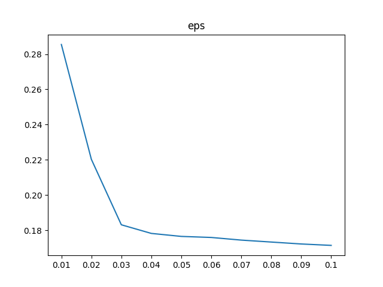
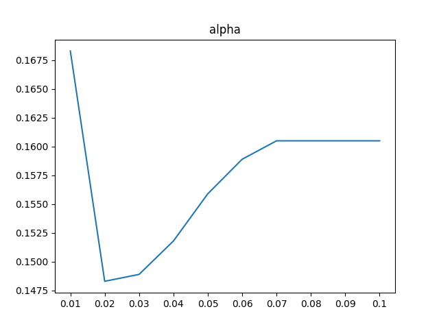
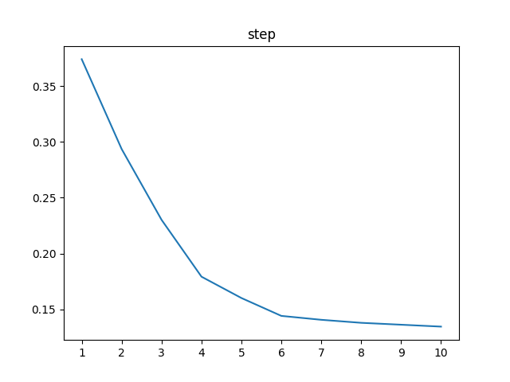

# 模型对抗与模型压缩
## 介绍
&emsp;&emsp;此项目是模型对抗与模型压缩大作业，详细的要求可以参考`notebook.ipynb`，此项目很好的实现了作业中的要求，并且完成了附加题中的feature squeezing，代码结构较好，程序健壮性高，能够支持对给出的防御方法进行不同的组合测试

&emsp;&emsp;代码中有较为详细的注释，并附有详细的说明文档来使用，同时可以很容易地复现下文中给出的结果
## 版本
- `python: 3.8.12`
- `pytorch: 1.11.0`
- `numpy: 1.22.3`
- `matplotlib: 3.5.1`
- `torchvision: 0.12.0`
- `scipy: 1.8.0`
- `opencv-python: 4.5.5.64`
- `CUDAVersion: 11.4`
## 代码结构
&emsp;&emsp;一共有六个主要文件，分别是`dataset.py`,`seed.py`,`model.py`,`train.py`,`main.py`,`visualize.py`,每个文件的作用如下：
- `dataset.py`: 处理数据集以及通过PGD生成对抗样本
- `seed.py`: 设置种子，确保实验可复现
- `model.py`: 定义了卷积神经网络，PGD，量化的卷积和线性层，以及动态阈值的激活函数
- `train.py`: 定义了训练函数和测试函数，同时定义了展示图片的可视化函数，可以将一个batch中攻击成功的图片展示出来（默认展示五张）
- `visualize.py`: 用来绘制PGD攻击效果随参数改变的图像
- `main.py`: 主函数，通过使用不同参数调用`main.py`可以方便地实现训练以及对抗攻击，并查看结果
## 使用方法
### `main.py`
运行如下命令行，可以使用命令行参数实现不同的功能  
> `python main.py`
- `-v,--verbose`,使用后训练过程将可视化,
- `-r,--random`,使用后训练时使用随机种子
- `-o,--output`,结果保存的文件，默认为`result.txt`
- `-no_report`,使用后不保存结果
- `-d,--device`,训练时的device，目前仅支持单卡
- `-b,--batch_size`,训练时的batch size，默认为`32`
- `-lr,--learning_rate`,训练时使用的学习率，默认为`1e-3`
- `-n,--num_of_epochs`,训练的epochs，默认为`10`
- `-ad,--adversarial`,使用后将进行对抗训练，***注意：使用对抗训练时要保证相同条件的非对抗训练已经完成并且保存了checkpoint***
- `-reg,--regularization`,使用后将添加正则化约束，目前仅支持对线性层和卷积层进行正则化约束，支持的正则项有`orthogonal`正交正则项,`spectral`谱范数正则项
- `-beta,--beta`,正则项的系数，默认为`1e-4`
- `-q,--quantize`,使用后将对模型进行量化操作，目前仅支持对于卷积层和线性层进行量化
- `-dy,--dynamic`,使用后将使用动态激活函数，实现了动态阈值的ReLu函数，但目前仅支持3d和1d的输入，即仅支持接在卷积层和线性层之后，***注意：开启动态激活函数后模型训练会变慢，请使用GPU进行训练***
- `-fs,--feature_squeeze`,使用后将进行特征压缩，目前支持bit深度压缩（2bit）(b)、局部空间平滑(l)和非局部空间平滑(n)
- `-s,--save`,使用后训练时将对checkpoint进行保存，会保存在test data上最优的一个epoch的结果
- `-l,--load`,使用后从checkpoint中加载参数，不再进行训练，仅测试PGD的攻击效果，***注意：不要和`-s`参数一起使用，虽然不会报错，但会优先加载模型，`-s`会被忽略***
- `-esp`,PGD攻击的esp，默认为`8/255`
- `-alpha`,PGD攻击的alpha，默认为`2/255`
- `-step`,PGD攻击的step，默认为`4`
- `-show`,是否对攻击结果进行可视化，会展示攻击成功的数据的原始图片和PGD加入噪声后的图片

例如
> `python main.py -v -r -o result.txt -d cuda:0 -ad -reg spectral -q -dy -fs l -s`

### `visualize.py`
运行如下命令行，可以使用命令行参数实现不同的功能  
> `python visualize.py`
- `-d,--device`,训练时的device，目前仅支持单卡
- `-aim`,要测试的PGD的参数，有eps,alpha,step

例如
> `python visualize.py -aim alpha -d cuda:1`

## 结果
### 可视化展示
&emsp;&emsp;对于没有任何防御措施的模型进行攻击的可视化效果如下

&emsp;&emsp;第一行为原始图片，能正确分类，第二列是PGD攻击后的图片，大多只是发生了颜色和亮度的变化，但能让原模型分类出错

### 防御措施对比
#### 基本防御措施
&emsp;&emsp;加入防御措施后的效果如下（*注：以下结果仅供参考，没有经过细致的参数调节，只能反映大概的结果，可以从checkpoint中加载对应的模型来验证数据的真实性*）

|量化|动态激活函数|正交正则(1e-4)|谱范数正则(1e-2)|对抗训练|acc/%|attack acc/%|
|:-:|:-:|:-:|:-:|:-:|:-:|:-:|
|×|×|×|×|×|73.8|17.9|
|√|×|×|×|×|72.9|25.5|
|×|×|√|×|×|73.0|22.9|
|×|×|×|√|×|74.4|24.2|
|√|√|×|×|×|73.9|25.1|
|√|×|√|×|×|73.0|22.9|
|√|×|×|√|×|**74.5**|22.9|
|√|√|×|√|×|**74.5**|22.9|
|×|×|×|×|√|72.1|49.8|
|√|×|×|×|√|72.3|51.1|
|×|×|√|×|√|72.4|50.7|
|×|×|×|√|√|73.1|51.5|
|√|√|×|×|√|73.8|**53.8**|
|√|√|×|√|√|72.9|52.6|

#### 特征压缩
&emsp;&emsp;加入特征压缩后的效果见下表（*注：只测试了无其他防御措施下的特征压缩的效果，没有经过细致的参数调节，结果仅供参考，可以参考使用方法中的命令来验证数据*）

|特征压缩|acc/%|attack acc/%|
|:-:|:-:|:-:|
|无|73.8|17.9|
|bit压缩(2bit)|73.5|23.6|
|局部空间平滑|69.2|29.4|
|非局部空间平滑|18.9|25.1|

&emsp;&emsp;可以看出对于非对抗样本的分类，非空间局部平滑会导致其准确率大幅下降，分析原因为该数据集经过了标准化，导致非局部空间平滑效果较差，在非标准化的数据集上也能带来提升

### 超参数对PGD攻击效果的影响
&emsp;&emsp;以下结果都只在无任何防御措施的模型上进行，可以调用`visualize.py`来复现结果

#### eps
&emsp;&emsp;随着eps逐渐变大，分类准确率变小，攻击更强

#### alpha
&emsp;&emsp;随着alpha逐渐变大，分类准确率在0.02到0.03之间取最小值，说明攻击效果最强

#### step
&emsp;&emsp;随着step逐渐变大，分类准确率变小，攻击更强

## 总结
&emsp;&emsp;对于防御措施，加入对抗训练是最有效的防御手段，能将攻击后准确率提高的50%左右，同时模型量化和加入谱范数正则项也有不错的效果。在没有对抗训练时加入动态阈值的激活函数反而引起了性能下降，可能是因为数据集太小或者超参数的设定问题，但加入对抗训练之后加入动态阈值的激活函数也可以提高一些性能，featuer squeezing也能得到一定的效果

&emsp;&emsp;对于PGD的攻击效果，参数eps越大攻击效果越好，说明限制越宽松，攻击效果越好；参数alpha在0.02到0.03之间时，攻击效果越好，alpha相当于每一步攻击的“步幅”，“步幅”过大或者过小，都不能达到比较好的攻击效果（和学习率有点像）；参数step是攻击的迭代次数，可以看到迭代次数越多攻击效果越好

#### 参考
1. https://github.com/muyuuuu/Adversarial-Attack
2. https://github.com/MrGoriay/pwlu-pytorch
3. https://arxiv.org/pdf/1704.01155.pdf
4. https://arxiv.org/abs/2104.03693
5. https://arxiv.org/abs/1706.06083
